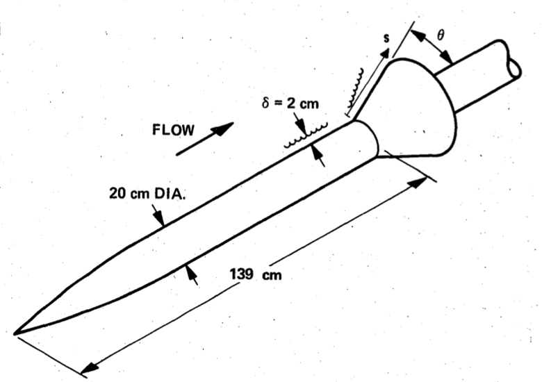
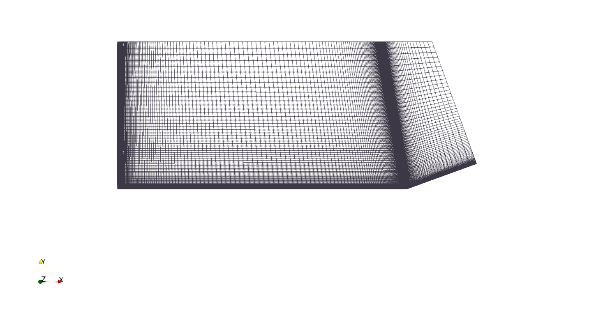
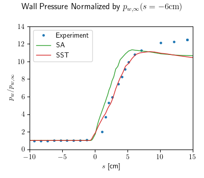
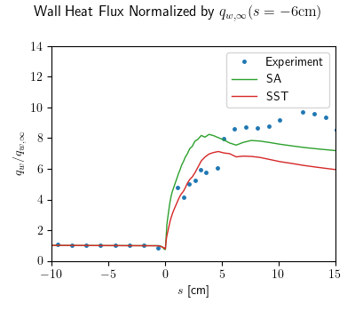

# Axisymmetric Shock Wave Boundary Layer Interaction (ASWBLI)

This case seeks to recreate the experimental results of Kussoy and Horstman [[1]](https://ntrs.nasa.gov/citations/19890010729) in which a supersonic stream passing over a cylinder interacts with a conical flare. This setup is detailed in the figure below and the results presented here only deal with the 20° flare. Per the experimient, the freestream temperature was 80K and the wall was kept constant at 311K. The initial experimental velocity was Mach 7.05, however its simulated value was 7.11 as advised by NASA's turbulence modeling resources [[2]](https://turbmodels.larc.nasa.gov/axiswblim7_val.html) if the initial ogive isn't modeled, which it wasn't here. The grid used here, also shown below, was a block structured mesh consisting of 20640 hexahedra and the boundary layer cells were placed such y+ was less than 2.

This simulation assumed axial symmetry and no flow in the angular direction, making it 2D axisymmetric. Two RANS turbulence models were used and compared in the figures below: k-ω SST (SST) and Spalart-Allmaras (SA). It's interesting to not that while the SA models produce much more accurate surface normal profiles upstream of the flare, it is SST which produces a more accurate wall pressure profile. For both models the pressure profiles fall off in accuracy halfway down the flare, however the same behaviour is exhibited by NASA's CFD codes [[2]](https://turbmodels.larc.nasa.gov/axiswblim7_val.html). Wall heat flux profiles are not very accurate on the other hand, but again demonstrate the same fall off behaviour that can be seen in the (admittedly more accurate) results of [[2]](https://turbmodels.larc.nasa.gov/axiswblim7_val.html).

Despite the inaccuracies in predicting experimental data, I still condsider this case as evidence of OpenFOAM's validity. The wall profiles, however inaccurate, behave similar to those produced by more established CFD codes, suggesting the errors are mostly caused by modelling assumptions, mesh geometry or something else and not OpenFOAM.

### Refrences

[1] M. I. Kussoy and C. C. Horstman, “Documentation of Two- and Three-Dimensional Hypersonic Shock Wave/Turbulent Boundary Layer Interaction Flows,” NASA-TM-101075, Jan. 1989. Accessed: Oct. 19, 2023. [Online]. Available: https://ntrs.nasa.gov/citations/19890010729

[2] Langley Research Center Turbulence Modeling Resources, "ASWBLI: Axisymmetric Shock Wave Boundary Layer Interaction near M=7." [Online]. Available: https://turbmodels.larc.nasa.gov/axiswblim7_val.html
