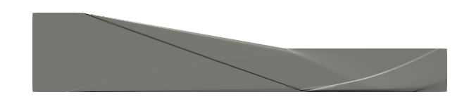
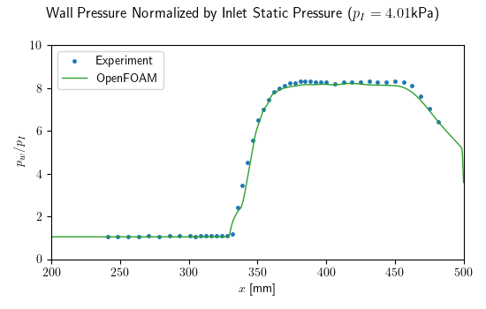

NOTE: This project is still a work in progress. While the OpenFOAM results presented below match experimental values to a good degree of accuracy, grid convergence has not been demonstrated. There are issues with the mesh quality, specifically the transition between prisims and bounday layer hexahera is too drastic (>5% cell size increase). This case can be considered a prooof of concept in the meantime.

# Shock Wave Boundary Layer Interaction (SWBLI)

This case attempts to recreate the Shock Wave Boudary Layer (SWBLI) experimental results of Schulein et. al. [[1]](https://elib.dlr.de/21724/), specifically the 10 degree wedge configuration. 

The mesh, generated using GMSH, is an unstructured 2D mesh dominated by triangular elements, except for the boundary layers on the top and bottom boundaries of the domain. Results presented here concern the 'fine' mesh, which has 222413 cells (84812 hexahera and 137601 prisms) and an average y+ value of 0.3 along the walls.

### Results

A synthetic schlieren of this case is presented below, revealing the shock structure.

Static pressure along the bottom wall, normalized by the inlet value, is compared to experimental data showing a good degree of accuracy. A more quantitative comparision can be found in the seperation/reatatchment locations, which are found by examing wall shear stress distrobutions. As simulated, these are 327 and 341 mm respectively, within 2% of the experimental 334±1 and 345±1 mm values biased towards the inlet.

### Refrences

[1] E. Schülein, “Skin Friction and Heat Flux Measurements in Shock/Boundary Layer Interaction Flows,” AIAA Journal, vol. 44, no. 8, pp. 1732–1741, Aug. 2006, doi: 10.2514/1.15110.

[2] https://www.grc.nasa.gov/WWW/wind/valid/m5swbli/m5swbli.html

