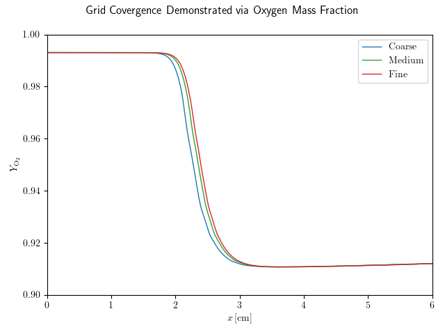
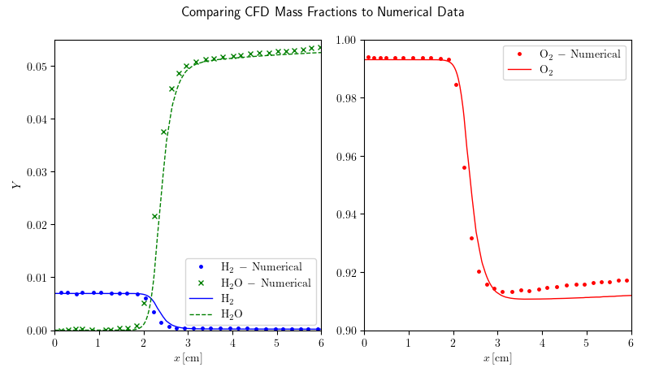

# Hydrogen Reacting Flow

The validation case of Mani et al. [[1]](https://arc.aiaa.org/doi/abs/10.2514/6.1991-3299), with numerical data given by DalBello and Vyas [[2]](https://www.grc.nasa.gov/WWW/wind/valid/channel/study03/channel3.html), is a laminar one-dimensional combustion channel where diatomic hydrogen and oxygen are the reacting fluids. In their numerical simulations, Mani et al. obtained a closed form solution assuming six species and eight reactions, solved using a Runge-Kutta scheme. A mixture of diatomic hydrogen and oxygen flows into the combustion chamber at Mach 1.82 and 1389 K.

The seven species, eight reaction mechanism of Evens and Schexnayder [[3]](https://arc.aiaa.org/doi/10.2514/3.50747), was used for this validation study. Grid convergence is confirmed comparing stream-wise oxygen mass fraction profiles assessed using 400, 600 and 800 cells, coarse, medium and fine sizes respectively. The resulting stream-wise mass fraction profiles obtained using OpenFOAM and the fine mesh to the numerical results of Mani et al., revealing a good level of agreement between the two calculation methods.

### Refrences

[1] M. Mani, R. Bush, and P. Vogel, “Implicit equilibrium and finite-rate chemistry models for high speedflow applications,” in 9th Applied Aerodynamics Conference, Baltimore,MD,U.S.A.: American Institute of Aeronautics and Astronautics, Sep. 1991. doi: 10.2514/6.1991-3299.

[2] T. DalBello and M. Vyas, “Channel Combustion.” [Online]. Available: https://www.grc.nasa.gov/www/wind/valid/channel/channel.html

[3] J. S. Evans and C. J. Schexnayder, “Influence of Chemical Kinetics and Unmixedness on Burning in Supersonic Hydrogen Flames,” AIAA Journal, vol. 18, no. 2, pp. 188–193, Feb. 1980, doi: 10.2514/3.50747.

