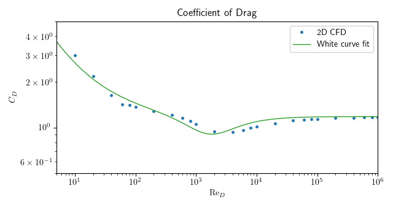
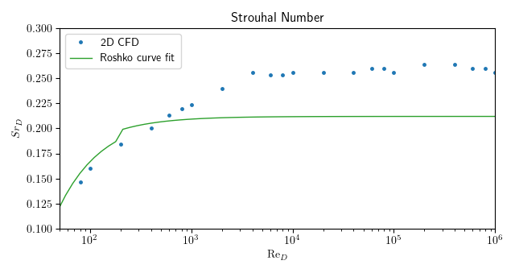

# Drag and Vortex Shedding of an Incompressible Cylinder

This case aims to accurately simulate drag around a cylinder in incompressible flow over a range of Reynolds numbers and their associated shedding frequency. The simulation was transient and turbulence was simulated using (U)RANS and the k-Ω SST model. Though it may have been more appropriate to switch to a laminar simulation at low $'\mathrm{Re}'$ numbers, the thought was that real world designs see laminar and turbulent regimes simultaneously, so a turbulent model needs to capture laminar flow just as accurately.

A block structured mesh was used consisting of 9,200 cells in the 2D case with y+ ranging from 12 to 175 for $'\mathrm{Re}_D=10^5'$. The blockage ratio, diameter to channel width, was 5%.

CFD results were evaluated against the coefficient of drag curve fit from White's Viscous Flows [[1]]:
$$C_D = 1.18 + \frac{6.8}{\mathrm{Re}_D^{0.89}} + \frac{1.96}{\mathrm{Re}_D^{0.5}} - \frac{0.0004 \mathrm{Re}_D}{1 + 3.64 \cdot 10^{-7} \mathrm{Re}_D^2} \quad \mathrm{Re}_D < 2\cdot10^5$$
and the Strouhal number fit from Roshko [[2]]:
$$\mathrm{Sr}_D = \frac{fD}{U}$$
$$\mathrm{Sr}_D = \begin{cases}0.212 - \frac{4.5}{\mathrm{Re}_D} & 50<\mathrm{Re}_D < 200 \\ 0.212 - \frac{2.7}{\mathrm{Re}_D} & 200 < \mathrm{Re}_D < 2000 \end{cases}$$
Though the Strouhal number curve fits are only applicable up to 2000, the curve has been extended in the graph below.

The above graph shows the CFD drag results are accurate up to the drag crisis which is not captured. Quantitatively, the relative error is 6% on average ranging from 1% to 12% for the 2D CFD data. The second graph, on the other hand, shows that 2D CFD Strouhal number data are not accurate. A case can be made for slowest flows that laminar vortex shedding is captured in the 2D simulations. 

NOTE: 3D simulations in progress

### Notes

The cases were built upon the example files provided with OpenFOAM [[3]](https://develop.openfoam.com/Development/openfoam/-/tree/master/tutorials/incompressible/pimpleFoam/LES/vortexShed) and used the block-structured mesh of Joel Guererro [[4]](https://wiki.openfoam.com/Flow_around_a_cylinder_by_Joel_Guererro). Through testing, I found that it was necessary for wall adjacent cells to be well outside the turbulent buffer layer the above level of accuracy over the full Re sweep. This would presumably also work if the cells were all inside the viscous layer for all Re numbers. A very fine mesh is required for this since y+ can vary by an order of magnitude over the cylinder, from stagnation to separation. As such, this idea is untested.

### OpenFOAM Specific Notes

For those wishing to make something similar, I wasn't able to simply convert the 2D OpenFOAM tutorial file to a RANS simulation and get the accuracy shown above over the full Re sweep. As well as the mesh requirements listed in the previous section, I found it necessary to remove all relaxation factors and change the Crank-Nicolson blending factor from 0.9 to 0.5 to reinforce numerical stability. These changes to the numerics resulted in drag coefficient errors being halved. My understanding of relaxation factors is that they shouldn't affect the converged value, only the speed of convergence. Unfortunately, I don't have an explanation for this. 

### Refrences

[1] F. M. White, Viscous fluid flow, 2nd ed. in McGraw-Hill series in mechanical engineering. New York: McGraw-Hill, 1991.

[2] A. Roshko, “On the development of turbulent wakes from vortex streets,” California Institute of Technology, 1952. doi: 10.7907/4WDN-9807.

[3] https://develop.openfoam.com/Development/openfoam/-/tree/master/tutorials/incompressible/pimpleFoam/LES/vortexShed

[4] https://wiki.openfoam.com/Flow_around_a_cylinder_by_Joel_Guererro
